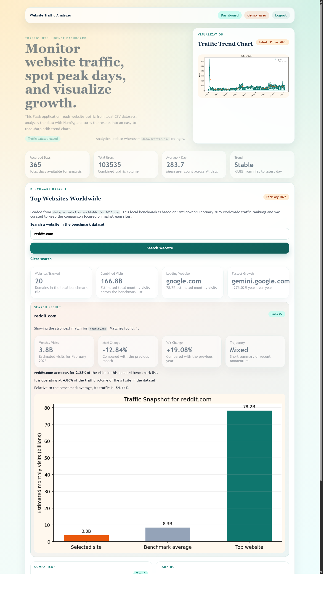

# Website Traffic Analyzer

Website Traffic Analyzer is a workshop-level Flask web application that analyzes website traffic data using local CSV datasets. It focuses on reading prepared traffic records, calculating useful statistics with NumPy, and presenting insights through charts and tables with Matplotlib.

The project is designed to be simple, practical, and easy to explain. All runtime Python logic is kept inside `app.py`, which makes the project suitable for classroom demos, workshops, and mini project presentations.

## Screenshots

### Login Page


### Dashboard Page



## Project Objective

The main objective of this project is to build a simple analytics system that:

- reads website traffic data from CSV files
- performs traffic analysis using Python
- displays visual trends and summary statistics
- lets users explore benchmark traffic for major websites

This project demonstrates how data analysis, visualization, and web development can be combined in a single Python application.

## Features

- Analyze traffic data from a local dataset
- Calculate total users, average traffic, trend direction, peak day, and lowest day
- Register and log in with SQL-backed user accounts stored in SQLite
- Display a traffic trend chart using Matplotlib
- Search a bundled benchmark dataset of major websites such as `google.com`, `youtube.com`, `reddit.com`, and `amazon.com`
- Compare benchmark websites by estimated monthly visits, month-over-month change, and year-over-year change
- Run entirely from a single Python file: `app.py`

## Technologies Used

- Python
- Flask
- NumPy
- Matplotlib
- SQLite
- HTML
- CSS
- CSV datasets

## Datasets Used

### 1. Traffic Dataset

File:

```text
data/Traffic.csv
```

Purpose:
- Used for traffic analysis
- Powers the dashboard summary cards and traffic chart

Important columns:
- `Date`
- `Combined Users`

### 2. Website Benchmark Dataset

File:

```text
data/top_websites_worldwide_feb_2025.csv
```

Purpose:
- Used for multi-website traffic comparison
- Supports website search and benchmark analysis

Included fields:
- website rank
- domain name
- estimated monthly visits
- month-over-month change
- year-over-year change

Note:
- This benchmark dataset is a curated academic/demo dataset based on public traffic-ranking information
- The benchmark values are estimated traffic figures, not internal analytics from those websites

## Application Pages

### 1. Dashboard

Route:

```text
/
```

This page shows:
- project overview
- traffic summary cards
- traffic visualization chart
- key insights
- benchmark dataset section
- website search analysis

### 2. Login Page

Route:

```text
/login
```

This page shows:
- login form
- registration form
- session-based access to the dashboard

## How the Project Works

1. The application reads the traffic CSV from the `data` folder.
2. It converts the dataset into structured traffic records.
3. NumPy is used to calculate:
   - total users
   - average users
   - change percentage
   - peak and lowest traffic days
   - simple trend direction
4. Matplotlib generates charts for visualization.
5. Flask renders the results in the browser using HTML templates.
6. A second dataset is used to compare traffic across major websites.
7. Users can search a website such as `reddit.com` or `amazon.com` to see focused benchmark analysis.

## Project Structure

```text
app.py
data/
    Traffic.csv
    top_websites_worldwide_feb_2025.csv
traffic_analyzer/
    static/
        style.css
    templates/
        base.html
        index.html
        login.html
report_assets/
    login_page.png
    dashboard_page.png
tests/
    test_analytics.py
    test_benchmark.py
    test_dataset_loader.py
    test_routes.py
requirements.txt
README.md
```

## Installation

1. Create and activate a virtual environment.
2. Install the required packages:

```powershell
venv\Scripts\pip.exe install -r requirements.txt
```

## Run the Project

Start the Flask application with:

```powershell
venv\Scripts\python.exe app.py
```

Then open:

```text
http://127.0.0.1:5000
```

## Testing

Run the test suite with:

```powershell
venv\Scripts\python.exe -m pytest
```

## Current Scope

This project currently focuses on:
- dataset-based traffic analysis
- SQLite-backed login authentication
- static benchmark comparison
- workshop-friendly architecture

It does not currently use:
- MySQL
- manual form-based traffic entry
- live traffic APIs

## Future Enhancements

- Add live traffic API integration
- Support more benchmark websites
- Add CSV upload from the browser
- Add filters by date range
- Add export options for charts and reports

## Summary

Website Traffic Analyzer is a simple but effective project for demonstrating web analytics concepts using Python. It combines Flask, NumPy, Matplotlib, and CSV-based datasets to provide meaningful traffic analysis in a clean web interface. Because the project logic is centralized in `app.py`, it is especially suitable for workshops, demonstrations, and academic presentations.
